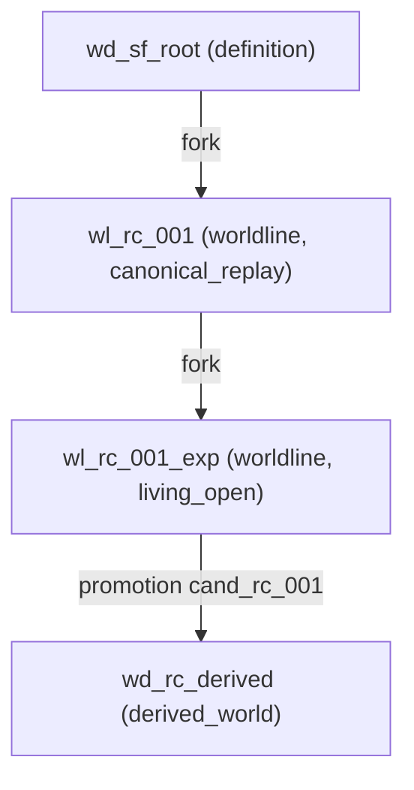

# V5.2 Lineage Graph Visualization (G31H)

Deterministic lineage DAG over world definitions / worldlines / derived worlds.

| Node | Kind | Constitution | Evolution policy |
|---|---|---|---|
| wd_rc_derived | derived_world | 1 |canonical_replay |
| wd_sf_root | definition | 1 |canonical_replay |
| wl_rc_001 | worldline | 2 |canonical_replay |
| wl_rc_001_exp | worldline | 1 |living_open |

| Edge | Kind | Origin |
|---|---|---|
| wd_sf_root -> wl_rc_001 | fork |  |
| wl_rc_001 -> wl_rc_001_exp | fork |  |
| wl_rc_001_exp -> wd_rc_derived | promotion | cand_rc_001 |

Fixture: `tests/fixtures/v5_2_lineage_graph.json` (hash 8113dc1d7179de2991ae3da33bc0dbd2eaa9e498cbc5e8aec87f8a12812e8d16)
